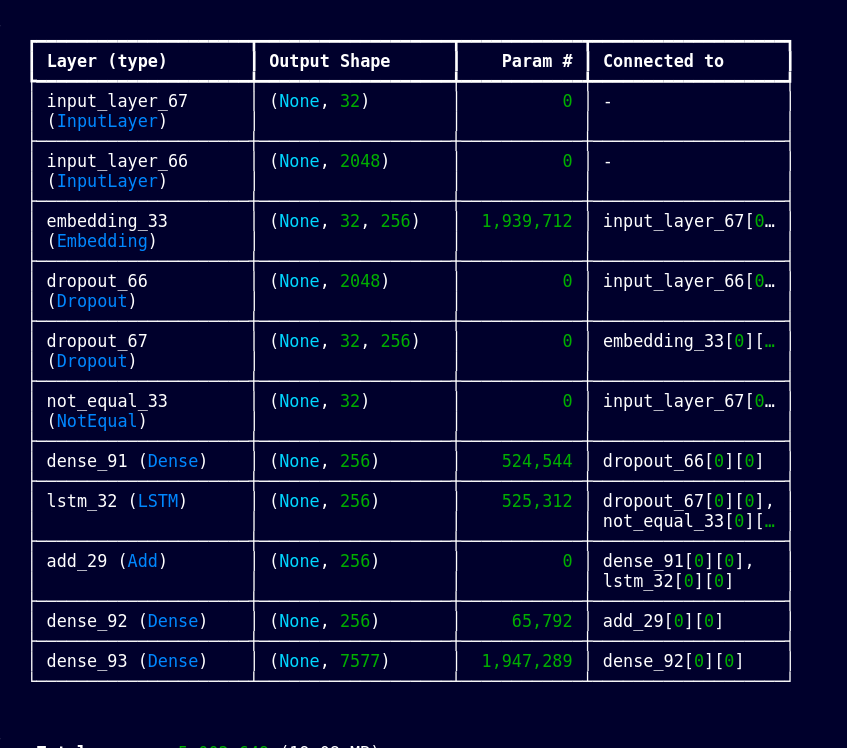
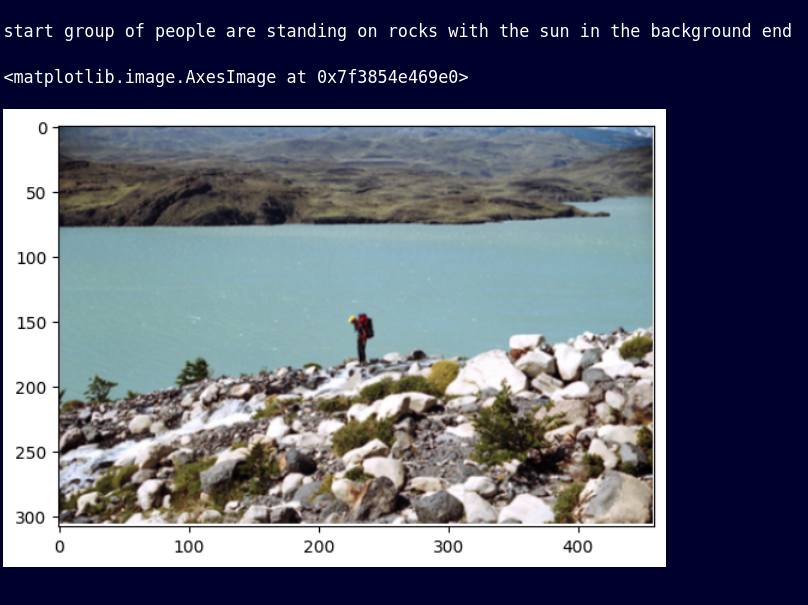

# Image Caption Generator

## Overview

This repository contains code for an image caption generator using deep learning models based on LSTM and CNN architectures. The model is trained on Flickr8k dataset, which can be accessed [here](https://github.com/jbrownlee/Datasets/releases/download/Flickr8k/Flickr8k_Dataset.zip).

## Model Summary

### Model Architecture

The image caption generator model architecture consists of a combination of Convolutional Neural Networks (CNNs) for image feature extraction and Long Short-Term Memory (LSTM) networks for caption generation.

## Files

- `training_caption.ipynb`: IPython Notebook containing the complete code for the image caption generator.
- `features.p`: Pickle file containing precomputed image features.
- `tokenizer.p`: Pickle file containing tokenizer object for text preprocessing.
- `models/model.keras`: Keras model file containing the trained image caption generator model.

## Workflow

### Running the Notebook

Open `image_caption_generator.ipynb` in Jupyter Notebook and execute each cell to reproduce the entire workflow of the image caption generator.

### Generating Captions

To generate captions for images using the pretrained model:

1. Load the model from `model.keras`.
2. Load `features.pkl` and `tokenizer.pkl`.
3. Use the model to generate captions for new images.

## Example Images

### Caption Generation

